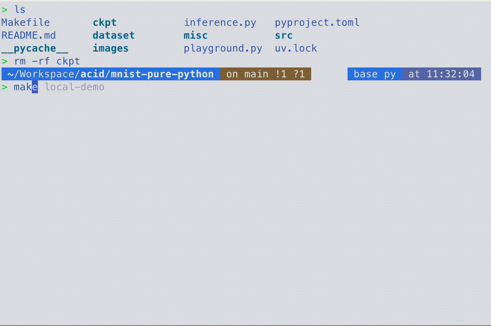
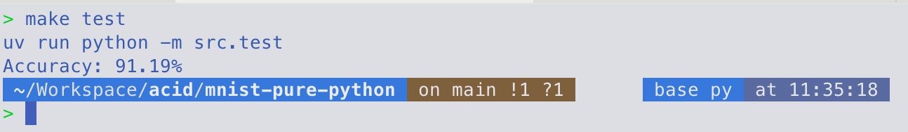
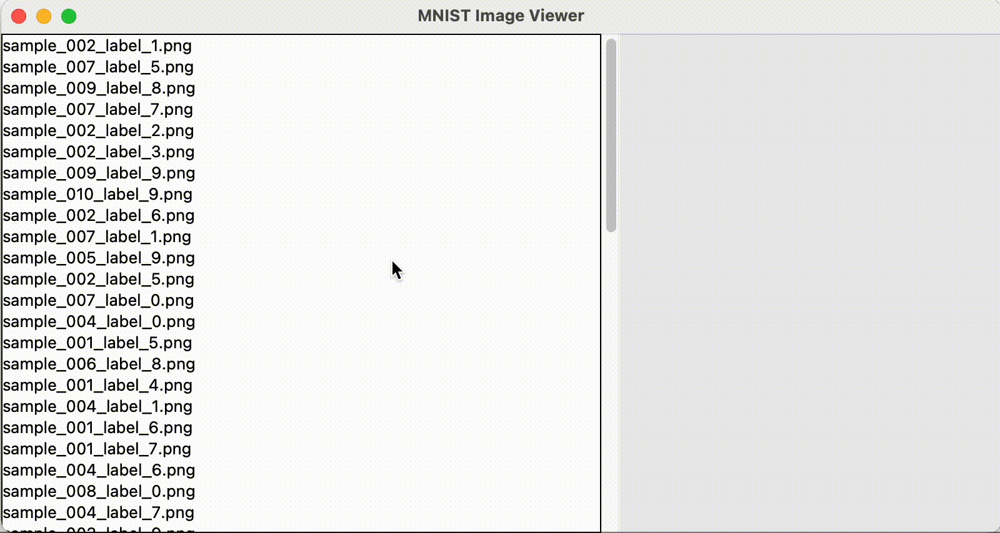

# MNIST with Pure Python

손글씨 인식모델을 별도의 머신러닝 프레임워크 없이 구현해봅니다.

Conv1 → BatchNorm1 → ReLU1 → Conv2 → BatchNorm2 → ReLU2 → Conv3 → BatchNorm3 → ReLU3

## Usage

```bash
> make help
Available targets:
  extract-sample  -  샘플 이미지 추출
  help            -  도움말 출력
  inference       -  모델 추론 (사용법: make inference img=path/to/image.jpg)
  inspect-data    -  dataset의 크기정보를 확인합니다.
  local-demo      -  GUI를 실행합니다.
  play            -  Playground
  test            -  모델 테스트
  train           -  모델 학습

Usage: make <target>
```

## Demo

### Web


[https://web.d3fau1t.net/mnist](https://web.d3fau1t.net/mnist)

### Train



### Test



### Inference


