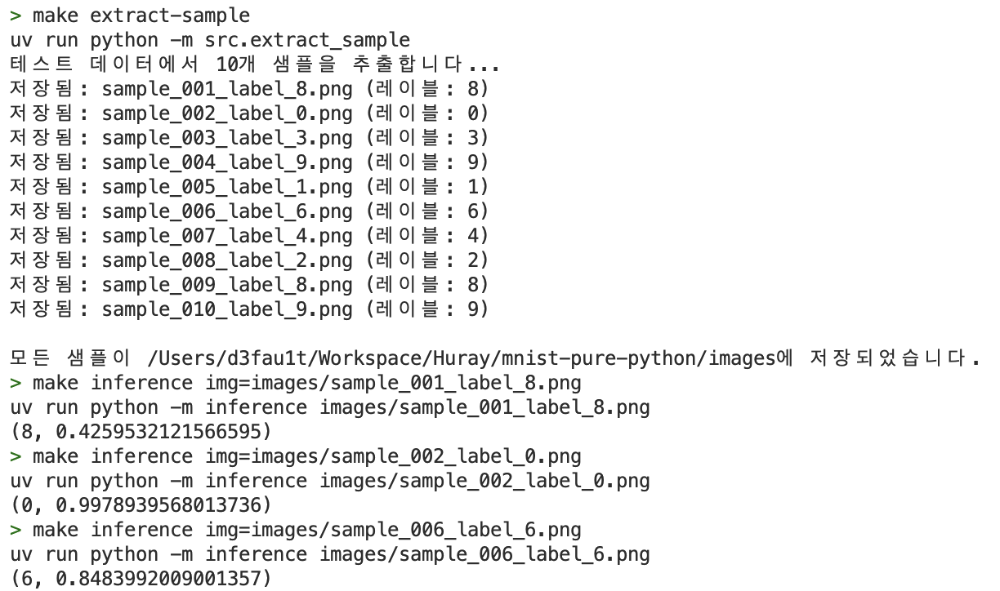

# MNIST with Pure Python

손글씨 인식모델을 별도의 머신러닝 프레임워크 없이 구현해봅니다.

Conv1 → BatchNorm1 → ReLU1 → Conv2 → BatchNorm2 → ReLU2 → Conv3 → BatchNorm3 → ReLU3

## Usage

```bash
> make help
Available targets:
  extract-sample  -  샘플 이미지 추출
  help            -  도움말 출력
  inference       -  모델 추론 (사용법: make inference img=path/to/image.jpg)
  inspect-data    -  dataset의 크기정보를 확인합니다.
  local-demo      -  GUI를 실행합니다.
  play            -  Playground
  test            -  모델 테스트
  train           -  모델 학습

Usage: make <target>
```

## Demo

### Web


[https://web.d3fau1t.net/mnist](https://web.d3fau1t.net/mnist)

### Train


### Test


### Inference

#### CLI

```bash
> make extract-sample
uv run python -m src.extract_sample
테스트 데이터에서 10개 샘플을 추출합니다...
저장됨: sample_001_label_8.png (레이블: 8)
저장됨: sample_002_label_0.png (레이블: 0)
저장됨: sample_006_label_6.png (레이블: 6)
...

모든 샘플이 /Users/d3fau1t/Workspace/Huray/mnist-pure-python/images에 저장되었습니다.
> make inference img=images/sample_001_label_8.png
uv run python -m inference images/sample_001_label_8.png
(8, 0.4259532121566595)
> make inference img=images/sample_002_label_0.png
uv run python -m inference images/sample_002_label_0.png
(0, 0.9978939568013736)
> make inference img=images/sample_006_label_6.png
uv run python -m inference images/sample_006_label_6.png
(6, 0.8483992009001357)
```



#### GUI


